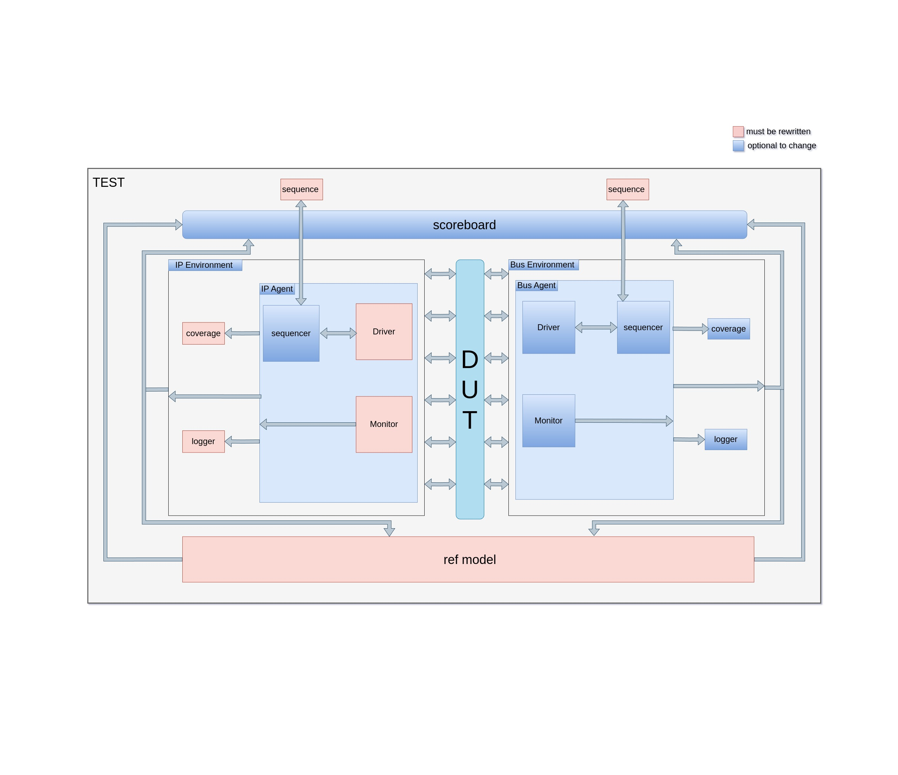

<p align="center">
  
</p>
<p align="center">
    <h1 align="center">EFABLESS-UVM-ENV</h1>
</p>
<p align="center">
    <em>Power up your designs with efabless-uvm-env</em>
</p>
<p align="center">
	<!-- local repository, no metadata badges. -->
<p>
<p align="center">
		<em>Developed with the software and tools below.</em>
</p>
<p align="center">
	
</p>
<hr>

##  Quick Links

> - [ Overview](#-overview)
> - [ Features](#-features)
> - [ Repository Structure](#-repository-structure)
> - [ Modules](#-modules)
> - [ Getting Started](#-getting-started)
> - [ Project Roadmap](#-project-roadmap)
> - [ Contributing](#-contributing)
> - [ License](#-license)

---

##  Overview

The EF_UVM is a resuable uvm testbench environment written using uvm-python library. The environment could be used for any IP/design after wrapping the design with one of the peripheral supported by efbless wrapper generator. As shown in Figure 1 below, The environment consisted of 2 sub environmnet one for the bus wrapper and the other is for the IP. Most of the testbench components can be used without modification and some should be updated for each IP.

Figure 1: Environment diagram.

---

## Prerequisites
- designed wrapped using ef_wrapper_gen
- python 3.7+
- [cocotb](https://github.com/cocotb/cocotb?tab=readme-ov-file#installation)
- [uvm-python](https://github.com/tpoikela/uvm-python?tab=readme-ov-file#uvm-library-for-python)
- docker

## Structure
### Testbench overview 
The testbench is written in Python using the UVM-Python library. Since the testbench is based on UVM, it adheres to the UVM standard. It also inherits the powerful features of UVM, such as reusability, scalability, and automation. As the design should consist of two parts, the bus wrapper (APB, AHB, etc.) and the IP, the testbench is also divided into two main environments: the Bus Environment and the IP Environment. Each environment is responsible for monitoring, driving, and collecting coverage for one part of the design. The two environments should then communicate with the reference model and the scoreboard. Each environment should have its separate sequence/sequences connected to its sequencer. If any dependency between the parts' sequences exists, it should be handled by the test.

### Environment
#### Functionality
Encapsulates verification components.
#### Components
Each environment have 3 main components: agent, coverage collector, and logger.
#### Connection between components
- The agent send data to the coverage collector and logger. 
#### Connection with other components
- The environment should be able to send data to the scoreboard and reference model.
- The environment should be able to send and receive data from the sequence.
- The environment should be be connected with one of the design interfaces.

### Agent
#### Functionality
Encapsulates a sequencer, driver, and monitor
#### Components
Sequencer, driver, and monitor.
#### Connection between components
- Driver and sequencer should have bidirectional connection. 
#### Connection with other components
- Monitor should be able to send data outside of the agent. 
- Sequencer should be connected with sequence/sequences by the test.
- Monitor and driver should be connected to the design interface.

### Monitor
#### Functionality
Capturing transactions and passing them to other components for further analysis or processing. It acts as a data capture mechanism within the testbench environment.
#### Connection with other components
- Monitor should be able to send data outside of the agent.
- Monitor should be connected to an hdl interface.

### Driver
#### Functionality
Driving transactions to the design under test (DUT). It interacts with the sequencer to fetch and execute the transactions.
#### Connection with other components
- Driver should be able to send and receive data from the sequencer.
- Driver should be connected to an hdl interface.

### Sequencer
#### Functionality
Controlling the flow of transactions between the driver and the DUT, as well as communicating with the sequence to coordinate the generation and execution of transactions.
#### Connection with other components
- Sequencer should be able to send and receive data from the driver.
- Sequencer should be able to send and receive data from the sequence.

### Coverage
#### Functionality
Observing the transactions captured by the agent and extracting coverage information from them.
#### Connection with other components
- Coverage should be able to receive data from the agent/monitor.

### Logger
#### Functionality
Capturing transactions and store them in a log file.
#### Connection with other components
- Logger should be able to send and receive data from the agent/monitor.

### Reference model
#### Functionality
Golden model or a trusted source of expected behavior, against which the actual behavior of the DUT is compared. It provides a basis for verifying the correctness of the DUT's functionality.
#### Connection with other components
- Reference model should be able to be able to receive data from the 2 environments. 
- Reference model should be able to send expected data to the scoreboard.

### Scoreboard
#### Functionality
Compares the actual results produced by the DUT with the expected results from the reference model. It helps in determining the correctness of the DUT's behavior by monitoring and analyzing the transactions and their outcomes.
#### Connection with other components
- Scoreboard should be able to receive data from the reference model.
- Scoreboard should be able to send data from the 2 environments.

### Test
#### Functionality
Managing the overall verification process. It coordinates the creation and execution of sequences, manages the test environment, and handles any dependencies between different parts of the testbench.

### UVMSequenceItem
#### Functionality
Represents a single transaction or data item that is passed between all the relevant components, including the monitor, sequence, sequencer, driver, etc. It encapsulates the information and behavior related to a specific transaction within the testbench environment.

## Updates required

### Intro
For new IPs all the red rectangles should be inherited from the parent IP and updated, then the type should be overridden in the test.

### Verilog top level 
a verilog file that initializes the wrapper and contains all the top level signal and information about how to dump the waves and time step should be added.
- [] TODO: Add example from uart or any ip

### Interface 
Interface mapping of the verilog signals to testbench is needed. This is done using by inherite from class [`sv_if`](https://github.com/tpoikela/uvm-python/blob/288b252228eedaa5967d552335f3692d3058cf3e/src/uvm/base/sv.py#L550) and mapping the signals to the testbench.

### UVMSequenceItem
UVM sequence items are the representation of transaction-level data for verification in a Universal Verification Methodology (UVM) environment. It is used to easily manage data between the testbench component. To overwrite it the class should be inherited from the [`ip_item`](https://github.com/efabless/EF_UVM/blob/main/ip_env/ip_item.py#L7) class. Three functions in the class should be overridden. `__init__` function should have variables representing the item, `convert2string` return the string representation of the item and `do_compare` has condition to compare the item with the another item.

### Monitor
Monitor is a component that observes and collects data from the design under test (DUT) interface and convert in to UVMSequenceItem. Mostly, only the run_phase function should be overridden after inheriting [`ip_monitor`](https://github.com/efabless/EF_UVM/blob/main/ip_env/ip_agent/ip_monitor.py#L8).

### Driver
Driver is a component that converts UVMSequenceItem into pin-level signals to interact with the design under test. Like the monitor, only the run_phase function should be overridden after inheriting [`ip_driver`](https://github.com/efabless/EF_UVM/blob/main/ip_env/ip_agent/ip_driver.py#L8).

### Reference model 
The model primary role is to act as a representative or mimic of the actual hardware components, including the IP and the bus. Inheriting from the [`ref_model`](https://github.com/efabless/EF_UVM/blob/main/ip_env/ref_model/ref_model.py#L8) class should be done.

### Sequence 
The sequence is the collection of the UVMSequenceItem that will be used to drive the testbench. The sequence should be updated after each test. sequences should be connected to the sequencers as the testbench has 2 sequencers, usually 2 more sequences are needed.
- [] TODO: Add example from uart or any ip

### Coverage 
Add coverage by inheriting from [`ip_coverage`](https://github.com/efabless/EF_UVM/blob/main/ip_env/ip_coverage/ip_coverage.py#L8) class.

### Logger
Add logger by inheriting from [`ip_logger`](https://github.com/efabless/EF_UVM/blob/main/ip_env/ip_logger/ip_logger.py#L8) class.

### Test 
#### TODO: copying and modifying the base test 
#### TODO: explain how use the base test to add new tests

### files to copy
#### TODO: update this section after creating the new flow

## How to run
#### TODO: update this section after creating the new flow

Until the flow is updated. copying and updating the Makefile from verified design is needed. Update the make file with the verilog files paths, yaml/json file path and tests names. 

To run APB 

```shell
make run_all_tests
make run_<test_name>
make run_all_tests TAG=<new_tag> BUS_TYPE=APB
```

To run AHB

```shell
make run_all_tests BUS_TYPE=AHB
make run_<test_name> BUS_TYPE=APB
make run_all_tests TAG=<new_tag> BUS_TYPE=APB
```


---
##  Project Roadmap

***TODO***

---

##  Contributing

***TODO***

<details closed>
    <summary>Contributing Guidelines</summary>

1. **TODO**
</details>

---

##  License

**TODO**

---
